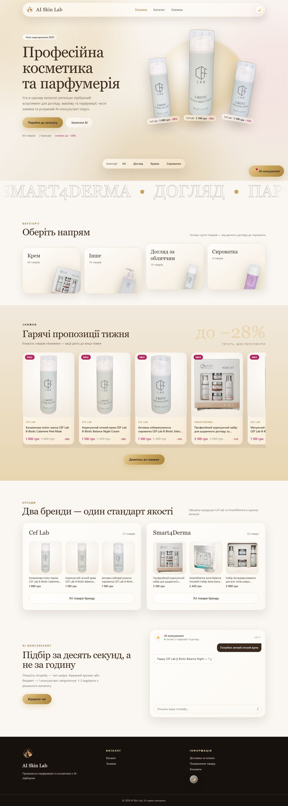
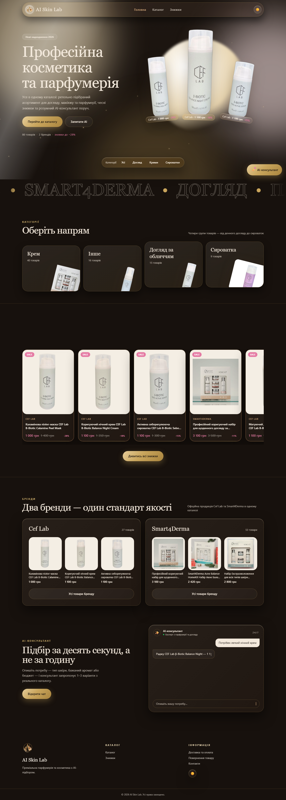
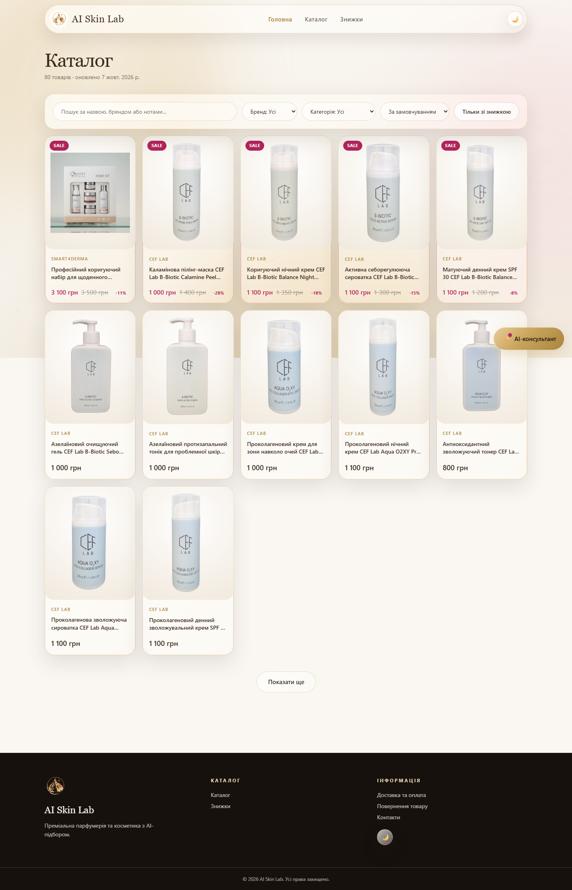
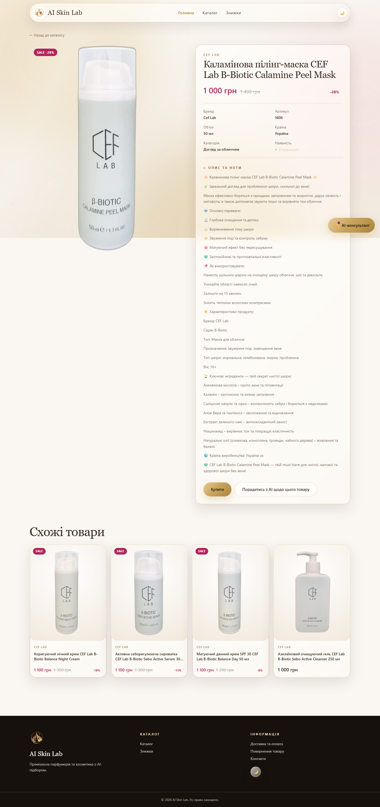

# AI Skin Lab

Premium cosmetics and perfumery catalog with AI consultant, living background, and modern UX.


---

## ✨ Features

- **Living Background** — animated gradients, particles, beam effect, cursor glow, dimming on dark sections
- **Hero with real cutouts** — 12 products with transparent backgrounds (rembg), parallax & floating animation
- **Categories with 3D tilt** — hover tilt up to 8°, product counters, catalog links
- **Hot Offers section** — Swiper free-mode, count-up animation "up to −28%"
- **Brands with clip-path reveal** — entrance animation via CSS clip-path
- **AI Consultant** — demo chat with typing effect 26 ms/char, respects `prefers-reduced-motion`
- **Smooth scroll** — Lenis (duration 1.1, easing exp)
- **Dark/Light theme** — next-themes, localStorage, system preference
- **Docker-ready** — standalone Next.js image, healthchecks

---

## 🛠 Tech Stack

### Frontend
| Technology | Version | Purpose |
|------------|---------|---------|
|  | 14.2 | App Router, SSR, standalone output |
|  | 18 | UI library |
|  | 5 | Type safety |
|  | 3 | Utility-first styling, design tokens |
|  | 11 | Animations, scroll-reveal, gestures |
|  | 1 | Smooth scrolling |
|  | 11 | "Sale" carousel (free-mode) |
|  | 0.3 | Theme switching |

### Backend / Infrastructure
| Technology | Version | Purpose |
|------------|---------|---------|
|  | 0.110 | REST API for catalog |
|  | 0.30 | ASGI server |
|  | 24 | Containerization |
|  | 2.24 | Orchestration |

### Code Quality / CI
| Tool | Purpose |
|------|---------|
|  | Linting |
|  | Formatting |
|  | E2E screenshots (375/768/1440 × light/dark) |
|  | Background removal for products (u2net) |

---

## 📸 Screenshots

| Home (Light) | Home (Dark) | Catalog | Product |
|:---:|:---:|:---:|:---:|
|  |  |  |  |

> Automatic screenshots generated by Playwright on each build: `python shoot.py`

---

## 🚀 Quick Start

### Local (without Docker)
```bash
# Frontend
cd frontend
npm install
npm run dev          # http://localhost:3000

# Backend (separate terminal)
cd ../backend
pip install -r requirements.txt
uvicorn app.main:app --reload --port 8000
```

### Docker (production-like)
```bash
docker compose up -d --build
# Frontend: http://localhost:3000
# Backend:  http://localhost:8000/docs
```

### Environment Variables
```env
# frontend/.env.local
NEXT_PUBLIC_API_URL=http://localhost:8000
```

---

## 📁 Project Structure

```
AI-Skin-Lab/
├── backend/                 # FastAPI
│   ├── app/
│   │   ├── main.py
│   │   ├── routers/
│   │   └── schemas.py
│   ├── requirements.txt
│   └── Dockerfile
├── frontend/                # Next.js 14
│   ├── src/
│   │   ├── app/            # App Router pages
│   │   ├── components/     # UI components
│   │   │   ├── Hero.tsx
│   │   │   ├── HeroProducts.tsx
│   │   │   ├── LivingBackground.tsx
│   │   │   ├── CategoriesSection.tsx
│   │   │   ├── SaleSection.tsx
│   │   │   ├── BrandsSection.tsx
│   │   │   ├── AiSection.tsx
│   │   │   ├── ProductDetailView.tsx
│   │   │   └── ...
│   │   ├── lib/            # API, types, formatting
│   │   ├── messages/       # i18n (uk.json)
│   │   └── i18n/           # Locale routing
│   ├── public/cutouts/     # WebP product cutouts (rembg)
│   ├── Dockerfile
│   └── next.config.js
├── docker-compose.yml
├── shoot.py                # Playwright screenshots
└── README.md
```

---

## 🎨 Design System

### Palette (CSS tokens in `globals.css`)
```css
:root {
  --cream:       #faf7f2;
  --sand:        #f1e9dd;
  --champagne:   #e8d5b0;
  --gold:        #c9a55c;
  --gold-deep:   #a9843e;
  --espresso:    #3a2a1e;
  --noir:        #17110d;
  --blush:       #f3dddd;
  --berry:       #b3235c;
}
```

### Key Components
- `.btn-primary` — gold gradient + animated shine
- `.glass` / `.tile` — glassmorphism cards with backdrop-filter
- `.section-noir` — dark band with gold accents (in light theme — warm gradient)
- `.pic` — `mix-blend-mode: multiply` for photos on warm background
- `.cat-tile` — 3D tilt (`transform-style: preserve-3d`)

---

## ♿ Accessibility

- `prefers-reduced-motion` — disables all animations
- Semantic HTML markup
- Focus styles for keyboard navigation
- Contrast ratios (WCAG AA)
- `aria-label` / `aria-pressed` on interactive elements

---

## 📦 Deployment

```bash
# Build images
docker compose build

# Run in production
docker compose up -d

# Logs
docker compose logs -f frontend
docker compose logs -f backend
```

> Frontend uses `output: standalone` — image ~150 MB, starts in <2 sec.

---

## 📄 License

**Private / Personal Use Only**

This project is the exclusive intellectual property of **Arthur Petrunko** (Arthurpetrunko@gmail.com).

All rights reserved. No part of this codebase may be reproduced, distributed, sublicensed, or used for commercial purposes without explicit written permission from the author.

© 2026 Arthur Petrunko. All rights reserved.

---

<p align="center">
  Made with ☕ by <a href="https://github.com/ArthurPetrunko">Arthur Petrunko</a>
</p>

---

# AI Skin Lab (Українська)

Преміальний каталог косметики та парфюмерії з AI-консультантом, живим фоном та сучасним UX.


---

## ✨ Особливості

- **Живий фон** — анімовані градієнти, частінки, beam-ефект, свічення курсору, затемнення на темних секціях
- **Hero з реальними вирізками** — 12 товарів з прозорим фоном (rembg), паралакс та плавання
- **Категорії з 3D-нахилом** — hover-tilt до 8°, лічильники товарів, посилання на каталог
- **Секція «Гарячі пропозиції»** — Swiper free-mode, count-up анімація «до −28%»
- **Бренди з clip-path reveal** — анімація появи через CSS clip-path
- **AI-консультант** — демо-чат з ефектом друку 26 мс/символ, підтримка `prefers-reduced-motion`
- **Плавний скрол** — Lenis (duration 1.1, easing exp)
- **Темна/світла тема** — next-themes, localStorage, системні налаштування
- **Docker-ready** — standalone Next.js образ, healthchecks

---

## 🛠 Технологічний стек

### Frontend
| Технологія | Версія | Призначення |
|------------|--------|-------------|
|  | 14.2 | App Router, SSR, standalone output |
|  | 18 | UI бібліотека |
|  | 5 | Типізація |
|  | 3 | Утілітарні стилі, дизайн-токени |
|  | 11 | Анімації, scroll-reveal, жести |
|  | 1 | Плавний скрол |
|  | 11 | Карусель «Знижки» (free-mode) |
|  | 0.3 | Перемикання теми |

### Backend / Інфраструктура
| Технологія | Версія | Призначення |
|------------|--------|-------------|
|  | 0.110 | REST API каталогу |
|  | 0.30 | ASGI сервер |
|  | 24 | Контейнеризація |
|  | 2.24 | Оркестрація |

### Якість коду / CI
| Інструмент | Призначення |
|------------|-------------|
|  | Лінтинг |
|  | Форматування |
|  | E2E скріншоти (375/768/1440 × light/dark) |
|  | Видалення фону товарів (u2net) |

---

## 📸 Скріншоти

| Головна (Light) | Головна (Dark) | Каталог | Товар |
|:---:|:---:|:---:|:---:|
|  |  |  |  |

> Автоматичні скріншоти генеруються Playwright при кожному білді: `python shoot.py`

---

## 🚀 Швидкий старт

### Локально (без Docker)
```bash
# Frontend
cd frontend
npm install
npm run dev          # http://localhost:3000

# Backend (окремий термінал)
cd ../backend
pip install -r requirements.txt
uvicorn app.main:app --reload --port 8000
```

### Docker (production-like)
```bash
docker compose up -d --build
# Frontend: http://localhost:3000
# Backend:  http://localhost:8000/docs
```

### Змінні середовища
```env
# frontend/.env.local
NEXT_PUBLIC_API_URL=http://localhost:8000
```

---

## 📁 Структура проекту

```
AI-Skin-Lab/
├── backend/                 # FastAPI
│   ├── app/
│   │   ├── main.py
│   │   ├── routers/
│   │   └── schemas.py
│   ├── requirements.txt
│   └── Dockerfile
├── frontend/                # Next.js 14
│   ├── src/
│   │   ├── app/            # App Router сторінки
│   │   ├── components/     # UI компоненти
│   │   │   ├── Hero.tsx
│   │   │   ├── HeroProducts.tsx
│   │   │   ├── LivingBackground.tsx
│   │   │   ├── CategoriesSection.tsx
│   │   │   ├── SaleSection.tsx
│   │   │   ├── BrandsSection.tsx
│   │   │   ├── AiSection.tsx
│   │   │   ├── ProductDetailView.tsx
│   │   │   └── ...
│   │   ├── lib/            # API, типи, форматування
│   │   ├── messages/       # i18n (uk.json)
│   │   └── i18n/           # Роутинг з локалі
│   ├── public/cutouts/     # WebP вирізки товарів (rembg)
│   ├── Dockerfile
│   └── next.config.js
├── docker-compose.yml
├── shoot.py                # Playwright скріншоти
└── README.md
```

---

## 🎨 Дизайн-система

### Палітра (CSS токени в `globals.css`)
```css
:root {
  --cream:       #faf7f2;
  --sand:        #f1e9dd;
  --champagne:   #e8d5b0;
  --gold:        #c9a55c;
  --gold-deep:   #a9843e;
  --espresso:    #3a2a1e;
  --noir:        #17110d;
  --blush:       #f3dddd;
  --berry:       #b3235c;
}
```

### Ключові компоненти
- `.btn-primary` — золотий градієнт + анімований блиск
- `.glass` / `.tile` — скляні картки з backdrop-filter
- `.section-noir` — темна смуга з золотими акцентами (у light темі — warm gradient)
- `.pic` — `mix-blend-mode: multiply` для фото на теплому фоні
- `.cat-tile` — 3D-нахил (`transform-style: preserve-3d`)

---

## ♿ Доступність

- `prefers-reduced-motion` — вимикає всі анімації
- Семантична HTML-розмітка
- Фокус-стилі для клавіатурної навігації
- Контрастність кольорів (WCAG AA)
- `aria-label` / `aria-pressed` на інтерактивних елементах

---

## 📦 Деплой

```bash
# Збірка образів
docker compose build

# Запуск у продакшні
docker compose up -d

# Логи
docker compose logs -f frontend
docker compose logs -f backend
```

> Frontend використовує `output: standalone` — образ ~150 MB, запуск за <2 сек.

---

## 📄 Ліцензія

**Private / Personal Use Only**

Цей проект є виключною інтелектуальною власністю **Arthur Petrunko** (Arthurpetrunko@gmail.com).

Усі права захищені. Жодна частина цього кодової бази не може бути відтворена, поширена, субліцензована або використана для комерційних цілей без письмового дозволу автора.

© 2026 Arthur Petrunko. Усі права захищені.

---

<p align="center">
  Made with ☕ by <a href="https://github.com/ArthurPetrunko">Arthur Petrunko</a>
</p>